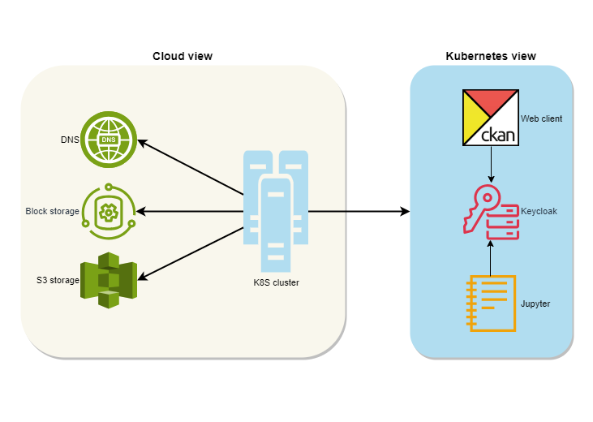

# Cloud Infrastructure

## Overview

The cloud infrastructure of the **ALTERNATIVE data platform** is a meticulously designed ecosystem, comprising a range of virtual services and hardware components tailored to support the platform's multifaceted operational requirements. At its core, the infrastructure leverages cutting-edge cloud computing technologies to ensure scalability, resilience, and security, which are paramount for handling the extensive data processing and analysis tasks inherent to the platform.

## Storage Solutions

At the heart of this infrastructure lies a suite of storage solutions, including both block storage and object storage services (such as S3). These storage services are designed to offer high durability, scalability, and accessibility, ensuring that data is securely stored and readily available when needed.

## Computational Resources

In terms of computational resources, the infrastructure boasts an array of Virtual Machines, each equipped with scalable CPU and Memory capabilities. Those are usually deployed by the Kubernetes managed service and act as Kubernetes nodes rather than serving as VMs directly.

## Virtual Networking

A key component of the cloud infrastructure is the virtual networking aspect. This includes a comprehensive network architecture that ensures secure, fast, and reliable communication between various services and components within the platform. The virtual networking setup is integral to maintaining the overall performance and integrity of the cloud environment.

## Kubernetes Cluster

Central to the infrastructure's capabilities is the Kubernetes cluster. This cluster plays a pivotal role in orchestrating containerized applications, ensuring their seamless deployment, scaling, and management. Kubernetes, renowned for its efficiency and flexibility, enhances the platform's ability to support a wide range of applications and services.

