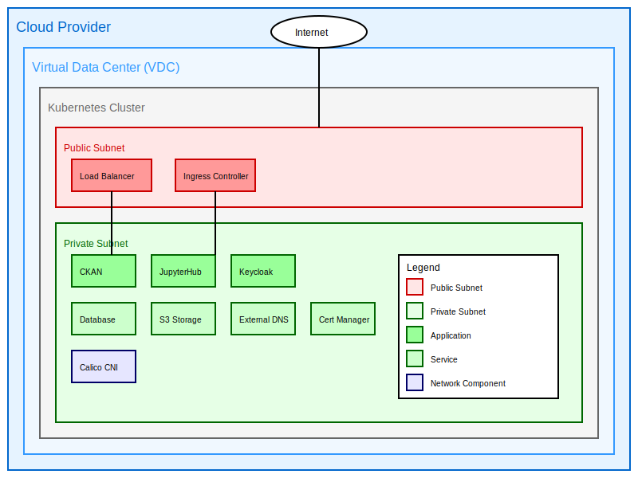

# Networking

## Overview

The ALTERNATIVE cloud data platform leverages a sophisticated network architecture designed to support robust, secure, and efficient operations for collaborative research in environmental toxicology. This infrastructure is crucial for facilitating the sharing of large datasets, running complex in-silico models, and enabling seamless collaboration among consortium partners.

The network is provisioned by a cloud provider, encompassing a comprehensive suite of virtual network functions:

1. **Virtual Data Center (VDC)**: A software-defined data center that provides virtualized compute, storage, and networking resources. In the ALTERNATIVE platform, the VDC serves as the foundation for hosting all project-related services and applications.

2. **Subnets**: Logical subdivisions of the IP network. The platform utilizes multiple subnets to segregate different types of traffic and services, enhancing security and performance. For example, separate subnets are used for the data sharing platform, JupyterHub computational environments, and administrative services.

3. **Public and Private IPs**: 
   - **Public IPs**: Globally routable addresses that allow resources to be accessed from the internet. In the ALTERNATIVE platform, public IPs are assigned to load balancers and ingress controllers, enabling external access to the web portal and API endpoints.
   - **Private IPs**: Internal addresses used for communication within the VDC. Most of the platform's services, including databases and backend applications, use private IPs to enhance security by limiting direct internet exposure.

4. **Network Gateways**: Devices that serve as entry and exit points between networks. The platform employs gateways to manage traffic flow between the internal network and external internet, implementing security policies and routing rules.

5. **Load Balancers**: Distribute incoming network traffic across multiple servers to ensure no single server becomes overwhelmed, improving the reliability and capacity of applications. In the ALTERNATIVE platform, load balancers are crucial for maintaining high availability of key services like the data portal and JupyterHub.

6. **Ingress Controllers**: Manage external access to services within the Kubernetes cluster. The platform uses NGINX-based ingress controllers to route HTTP and HTTPS traffic to the appropriate internal services based on defined rules.

The network architecture prioritizes:

1. **Security**: Implementing multiple layers of protection, including network segmentation, encryption, and access controls, to safeguard sensitive research data on chemical toxicity and biological responses.

2. **Scalability**: Designed to accommodate growing volumes of omics data and an expanding user base of researchers and regulatory bodies without compromising performance.

3. **Flexibility**: Adaptable to various research requirements, supporting diverse computational workflows and potential future expansions in the field of environmental toxicology.

4. **Performance**: Optimized for high-speed data transfer and low-latency operations crucial for running complex in-silico models and analyzing large-scale experimental data.

5. **Compliance**: Engineered to meet data protection regulations and ethical guidelines pertinent to handling sensitive biological and chemical data.

## Kubernetes Networking

The ALTERNATIVE platform leverages Kubernetes as its container orchestration system. Kubernetes, often abbreviated as K8s, is an open-source platform designed to automate deploying, scaling, and operating application containers. In the context of the ALTERNATIVE project, Kubernetes plays a crucial role in managing the containerized applications that form the core of the data sharing and analysis infrastructure.

Key Kubernetes networking concepts utilized in the ALTERNATIVE platform include:

1. **Pods**: The smallest deployable units in Kubernetes. In the ALTERNATIVE platform, pods host individual components of services like data platform, JupyterHub, and various data processing pipelines.

2. **Services**: Kubernetes abstractions that define a logical set of pods and a policy by which to access them. For example, the web interface and API are exposed as Kubernetes services.

3. **NetworkPolicies**: These are specifications of how groups of pods are allowed to communicate with each other and other network endpoints. In the ALTERNATIVE platform, NetworkPolicies are used to enforce strict access controls between different components, enhancing security.

The platform utilizes a managed Kubernetes service provided by the cloud provider. This approach offers several advantages:

- Simplified cluster management and maintenance
- Automated scaling and self-healing capabilities
- Seamless integration with cloud provider's storage and networking services
- Enhanced security through regular, automated updates

### Container Network Interface (CNI)

In the Kubernetes environment, **Calico** is selected as the Container Network Interface (CNI) plugin. Calico is an open-source networking and network security solution for containers, virtual machines, and native host-based workloads. It's chosen for the ALTERNATIVE platform due to its:

- High performance and scalability, crucial for handling large-scale data processing tasks
- Advanced network policy features, allowing fine-grained control over inter-pod communication
- Compatibility with a wide range of cloud providers and deployment scenarios

Calico provides a full networking stack for Kubernetes, but in the ALTERNATIVE platform, it's primarily used for its network policy enforcement capabilities, working alongside the cloud provider's native container networking solution.

## Application Networking

The networking of applications in the ALTERNATIVE platform emphasizes strong isolation of network segments. This is achieved through:

1. **Kubernetes Namespaces**: Logical partitions within the cluster that provide scope for names and allow for fine-grained access control. Separate namespaces are used for different components of the platform, such as CKAN, JupyterHub, and supporting services like Keycloak for authentication.

2. **Pod Security Policies**: These control security-sensitive aspects of pod specification, restricting the capabilities of containers and enhancing overall system security.

Traffic ingress is managed by an **NGINX-based Ingress controller**. This controller:

- Routes external HTTP and HTTPS traffic to the appropriate services within the cluster
- Terminates SSL/TLS connections
- Provides features like URL rewriting, rate limiting, and authentication

## Security

Security is a paramount concern in the ALTERNATIVE platform's network architecture, particularly given the sensitive nature of the toxicological and biological data being processed. Key security measures include:

1. **TLS Encryption**: All external traffic (e.g., users accessing the web portal) is encrypted using TLS protocols.

2. **cert-manager**: This Kubernetes add-on automates the management and issuance of TLS certificates. In the ALTERNATIVE platform, cert-manager is configured to automatically obtain and renew certificates from Let's Encrypt, ensuring that all services are always protected by valid SSL/TLS certificates.

3. **Network Policies**: Kubernetes NetworkPolicies are extensively used to control traffic flow between different components of the platform, implementing the principle of least privilege.

4. **Secure API Gateway**: All external API access is routed through a secure API gateway that handles authentication, rate limiting, and monitoring.

## DNS Configuration

DNS (Domain Name System) configuration is a critical aspect of the ALTERNATIVE platform's network setup. It's managed by the **external-dns** Kubernetes addon, which automates the creation and management of DNS records.

Key features of the DNS setup include:

1. **Automated DNS Management**: external-dns watches for new or deleted services and ingresses in the Kubernetes cluster and automatically creates, updates, or deletes corresponding DNS records in the configured DNS provider.

2. **Support for Multiple DNS Providers**: While the ALTERNATIVE platform primarily uses the cloud provider's DNS service, external-dns supports a wide range of DNS providers, offering flexibility for future changes or multi-cloud deployments.

3. **Integration with Ingress Controllers**: external-dns works seamlessly with the NGINX ingress controller, automatically creating DNS entries for newly deployed services exposed via ingress rules.

4. **TTL Management**: Time-to-Live (TTL) values for DNS records are carefully managed to balance between rapid propagation of changes and reducing load on DNS servers.

5. **Alias Record Support**: For services that benefit from cloud provider-specific routing optimizations, external-dns can create alias records (like AWS Route53 Alias records) instead of standard A records.

This automated DNS management significantly reduces manual effort and the potential for errors, ensuring that all services within the ALTERNATIVE platform are consistently accessible via their designated hostnames.

## Conclusion

The network architecture of the ALTERNATIVE cloud data platform is a sophisticated system designed to meet the unique requirements of collaborative research in environmental toxicology. By leveraging advanced technologies like Kubernetes, implementing robust security measures, and automating key processes like DNS management, the platform provides a secure, scalable, and efficient infrastructure for data sharing and analysis.

This architecture not only meets the current demands of the ALTERNATIVE project but is also designed to be adaptable and scalable for future needs. As the field of environmental toxicology evolves and new computational methods emerge, the platform's networking infrastructure is well-positioned to support ongoing research and collaboration among consortium partners and the wider scientific community.