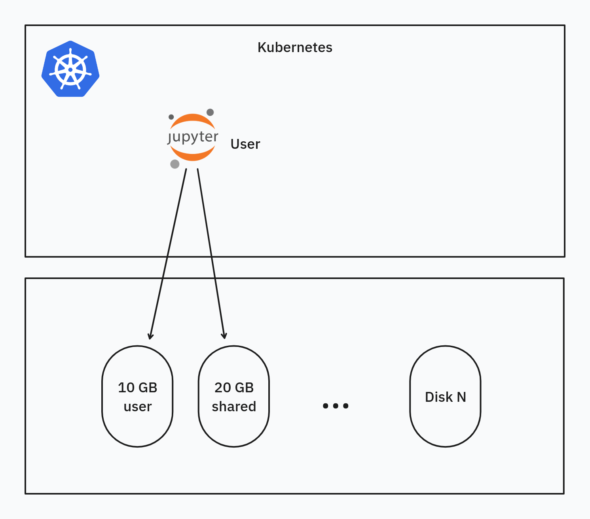

# Storage

## Overview

The storage architecture within the ALTERNATIVE platform is designed to provide robust, scalable, and persistent data storage solutions. This is achieved by leveraging Kubernetes' powerful storage abstractions: `StorageClass`, `Persistent Volume Claim (PVC)`, and `Volume`. These abstractions decouple applications from the underlying storage infrastructure, enhancing flexibility and scalability.

**Figure 2:** ALTERNATIVE cloud storage architecture

### Dynamic Allocation of Data Volumes

The platform utilizes Kubernetes' dynamic provisioning capabilities to allocate data volumes as needed. This approach ensures efficient use of storage resources by creating volumes on-the-fly to meet application demands, eliminating the need for pre-provisioning storage, optimizing resource allocation, and reducing overhead.

### Persistence and Reattachment

A key feature of the platform's storage strategy is data persistence, crucial for maintaining data integrity and continuity. Persistent data volumes remain intact even if the associated application is terminated or fails. These volumes can be seamlessly reattached to other instances of the application, ensuring data continuity and minimizing downtime.

### Delegation of Scalability and Recovery

The platform delegates scalability, recovery, and persistence responsibilities to the cloud provider. By leveraging the cloud provider's robust infrastructure and services, the platform benefits from high scalability and efficient recovery mechanisms. This delegation allows the platform to focus on its core functionalities while relying on the cloud provider for maintaining storage resilience and scalability.

### Types of Storage Used

- **Block Storage:** The platform employs block storage as the primary file system for applications. This type of storage is ideal for scenarios where performance and low latency are critical, providing high-speed access to data suitable for various workloads.
- **S3 Storage:** For the Data storing and sharing component of the platform, S3 storage is utilized. Known for its scalability and durability, S3 is an object storage service offering a simple and cost-effective solution for storing and retrieving large amounts of data, aligning well with platform's design goal of handling large datasets.

## S3 Storage

The ALTERNATIVE platform has specific storage requirements due to the potentially large size of datasets, particularly those containing omics data. To manage these datasets effectively, the platform utilizes S3-compatible storage, which is well-suited for handling high volumes of data.

### Scalability and Cost-Effectiveness of S3

S3 storage is chosen for its exceptional scalability and cost-effectiveness. It handles vast amounts of data, scaling seamlessly with the platform's storage needs. This scalability ensures that as the volume of omics data grows, the storage infrastructure can grow correspondingly without significant challenges. Additionally, S3's pricing model, which involves paying only for the storage used, makes it a cost-effective solution for managing large datasets.

### Custom Platform Integration with S3

Integration with S3-compatible storage is achieved through a custom extension, enabling efficient interaction with the storage backend. This facilitates optimized data storage and retrieval processes, ensuring both performance and reliability.

### Direct Interface with S3

In the ALTERNATIVE platform, the data management component interfaces directly with S3-compatible storage, bypassing integration through the Kubernetes layer. This direct interaction streamlines data flow, minimizing complexity and reducing potential bottlenecks associated with additional integration layers.

### S3 Storage Service and Minio Library

The S3 storage service provided by the cloud provider utilizes the MinIO library, an open-source object storage server fully compatible with Amazon S3 APIs. MinIO enhances the platform's ability to interact with S3 storage efficiently and securely.

### API-based Data Exposure

The platform does not expose the underlying S3-compatible storage directly to end users. Instead, it provides a dedicated set of APIs for data access, ensuring controlled and secure interaction with stored data. This approach enhances security and enables the implementation of additional features and access controls, governing how data is retrieved and utilized.

In summary, the use of S3-compatible storage within the ALTERNATIVE platform addresses the specific requirements of large-scale omics data management. The custom integration, combined with a direct interface approach and the use of the MinIO library, ensures efficient handling of large datasets while maintaining both cost-effectiveness and security.

## Block Storage

In the ALTERNATIVE platform, block storage is the main type of data storage utilized by applications. This section details the implementation and management of block storage within the platform's architecture.

### Exposure as File System

Block storage is exposed to applications and services as a file system, allowing developers to interact with the storage using standard file operations. This method simplifies the process of reading from and writing to the storage medium, making it highly accessible for a variety of applications.

### Underlying Storage System

Block storage systems are typically disk-based, utilizing either Hard Disk Drives (HDD) or Solid State Drives (SSD). The choice between HDD and SSD depends on a trade-off between cost and performance. SSDs, with their faster data access speeds, are well-suited for high-performance requirements, while HDDs are used for cost-effective storage solutions where speed is less critical.

### Consumption via Kubernetes APIs

Block storage within the platform is consumed through Kubernetes APIs using volumes, Persistent Volume Claims (PVCs), and Storage Classes. This integration ensures seamless and efficient management of storage resources within the platform's ecosystem. The platform offers flexibility in defining different storage classes tailored to meet varying performance requirements, allowing customization based on the specific needs of different applications or services.

### Decoupling of Applications from Storage

Using block storage in this manner decouples applications from the physical storage, enhancing flexibility in scenarios such as backup, disaster recovery, and migration. By abstracting the storage layer, applications can be easily moved, backed up, or restored without managing the complexities of the underlying storage infrastructure, significantly improving the platform's resilience and agility in handling data.

## NFS

The platform deploys an NFS (Network File System) server to provide an additional storage class for some applications. For instance, JupyterHub users require a shared data folder for collaboration, necessitating a storage class with mode `ReadWriteMany`. Since the cloud provider only offers block storage classes of type `ReadWriteOnce`, the NFS server is used to expose such a volume.

## ALTERNATIVE Data Management Storage

The Platform uses several types of storage:
- **Database:** A relational database (Postgres) is used to store the application state, including metadata and user data.
- **S3:** User-defined datasets are mapped to S3 buckets.
- **Block Storage:** Regular files, such as configuration files needed by the Platform, use block storage.

## JupyterHub Storage

**Figure 3:** Diagram of Jupyter Storage

JupyterHub has more complex storage requirements compared to other ALTERNATIVE services.

### Multi-user Capability

Each user is dynamically allocated a Kubernetes POD containing the Jupyter kernel and runtime. The POD is ephemeral, but its associated data must persist to a user volume (10 GB). Each user is allocated this volume upon first login, and it remains after session timeout or logout. When the POD is recreated, it attaches to the same volume, preserving the user's state from the last session.

### Shared Folder

Users can share data directly in Jupyter via a shared folder mapped to a static volume (20 GB) with mode `ReadWriteMany`. Multiple PODs must be able to attach and write to this volume simultaneously, provided by the NFS server.

### Accessing ALTERNATIVE platform data from Jupyter

A custom Python library, `alternative-lib`, simplifies access to ALTERNATIVE/S3 data from Jupyter. Hosted on GitHub as an open-source project, it enhances user experience by providing seamless data access.

## Databases

A Postgres database, deployed within the Kubernetes plane, is used by the Platform and Keycloak services, leveraging block storage.