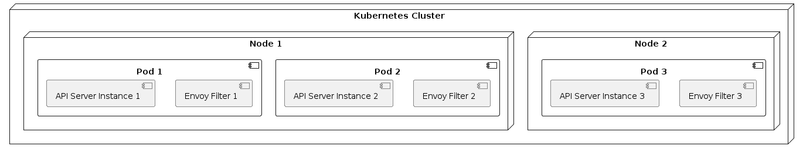

# Scalability

To accommodate varying loads and optimize resource utilization, our system employs a multi-faceted approach to scalability. This document outlines the key strategies used to ensure that the system can handle growth in demand without compromising on performance.

## Horizontal Scaling

Horizontal scaling, also known as scaling out, involves adding more instances of the API servers to distribute the load evenly. This approach is particularly effective for handling an increase in user requests.

- **Stateless API Servers**: Our API servers are designed to be stateless, which means they do not store any user data between requests. This design choice allows us to add or remove server instances without impacting the system's state or performance.
  
- **Kubernetes Horizontal Node Scaling**: We leverage on the Cloud Provider's Kubernetes environment to automatically scale the number of nodes based on resource utilization. This ensures that the system can handle varying loads efficiently.

### Benefits of Horizontal Scaling

- **Flexibility**: Easily adjust capacity by adding or removing instances.
- **Fault Tolerance**: Reduced impact of a single instance failure on the overall system.
- **Cost-Effectiveness**: Pay only for the resources you need, when you need them.

## Auto-Scaling

Auto-scaling encompasses both horizontal scaling strategies and applies them automatically in response to traffic patterns and system load.

- **Burst Scaling**: Our system is capable of burst scaling, which is a form of auto-scaling designed to handle sudden spikes in traffic. This ensures that the system remains responsive during unexpected surges in demand.

### Benefits of Auto-Scaling

- **Responsiveness**: Quickly adapts to changes in load, ensuring consistent performance.
- **Cost Efficiency**: Resources are scaled up only when needed, reducing unnecessary expenditure.
