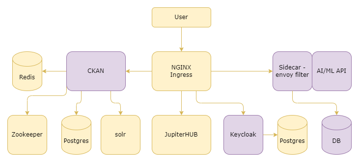

# System Architecture

The AI/ML API Server is a system designed to provide a unified interface for accessing and utilizing various machine learning (ML) models developed by the consortium partners of the ALTERNATIVE project. The core component of the system is the API Server, which is built using Python, Flask, and Gunicorn.

## Overview

When a client application sends a request to the API Server, the request first goes through the Istio Service Mesh, which is responsible for secure communication, monitoring, and traffic management. The request is then intercepted by a custom Envoy Filter, implemented in Go, which handles token-based authentication and authorization by integrating with Keycloak, an identity and access management system.

Keycloak manages user identities and access control policies, ensuring that only authorized users can access the API and its resources. The custom Envoy Filter validates the user's token and checks their permissions before allowing the request to proceed to the API Server.

If the user is authenticated and authorized, the request is forwarded to the API Server, which interacts with the appropriate ML model(s) to perform the requested task, such as predictive analytics. The ML models are developed using frameworks like TensorFlow, PyTorch, R, and scikit-learn, and are provided by the ALTERNATIVE project participants.

The API Server processes the request, obtains the necessary results from the ML model(s), and generates a response, which is then sent back to the client application through the same secure communication channel.

The system also integrates with CKAN, a data management platform, which handles access token management. Users can create, renew, and revoke their API tokens through a user-friendly interface provided by CKAN. Revoked tokens are stored in a PostgreSQL database to ensure that they cannot be used for unauthorized access.

The entire system is designed to be secure, scalable, and efficient. Security measures include HTTPS encryption, data encryption at rest and in transit, and role-based access control (RBAC) mechanisms. Scalability is achieved through the use of Docker for containerization and Kubernetes for container orchestration, allowing the system to scale up or down as needed to handle increased demand.

Overall, the AI/ML API Server provides a centralized and secure way for client applications to access and utilize a variety of machine learning models, while ensuring proper authentication, authorization, and scalability.

## Components

### AI/ML API Server

- **Description:** The AI/ML API server is the core component that exposes the REST API. It handles requests from clients, interfaces with machine learning models, and returns processed results. This server ensures efficient communication between the client applications and the underlying ML models.
- **Responsibilities:** 
    - Handling incoming requests from various clients.
    - Interacting with machine learning models to process data.
    - Generating and returning responses based on model outputs.
- **Technologies:** 
    - Python: For implementing the server logic and interfacing with ML models.
    - Flask: As the web framework for creating the RESTful API.
    - Gunicorn: As the WSGI HTTP server for handling concurrent requests and ensuring high performance.

### Istio Service Mesh

- **Description:** The Istio Service Mesh is a robust infrastructure layer that provides a uniform approach to securing, connecting, and monitoring microservices. It significantly enhances the security, reliability, and observability of microservices by offering advanced features like mutual TLS authentication, traffic control, and telemetry collection.
- **Responsibilities:** 
    - Security: Implementing strong security policies, including mutual TLS and fine-grained access controls.
    - Monitoring: Collecting and analyzing telemetry data to provide deep insights into service performance and health.
    - Traffic Management: Managing traffic flow between services, including load balancing, traffic splitting, and fault injection to ensure smooth and reliable service interactions.
- **Technologies:** 
    - Istio: For service mesh management, providing a comprehensive suite of features to control and observe service interactions.
    - Envoy: As the high-performance proxy that intercepts and routes all traffic within the service mesh, enabling sophisticated traffic management and security enforcement.

### Custom Envoy Filter

- **Description:** The custom Envoy filter, implemented in Go, provides robust token-based authentication and authorization. This filter seamlessly integrates with Keycloak to manage identity and access control, ensuring secure and authorized communication between services.
- **Responsibilities:** 
    - Authentication: Verifying the identity of users or services through token validation, ensuring that only authenticated entities can access the services.
    - Authorization: Enforcing access control policies by checking the permissions associated with each token, thus ensuring that only authorized actions are allowed.
- **Technologies:** 
    - Go: For developing the filter, taking advantage of its concurrency features and performance.
    - Envoy: As the service proxy, which the filter extends to handle custom authentication and authorization logic.
    - Keycloak: For identity and access management, providing a centralized platform for authentication and authorization services.

### Keycloak Identity and Access Management

- **Description:** An open-source system for managing authentication, authorization, and user management services.
- **Responsibilities:** Identity management, access control.
- **Technologies:** Keycloak.

### CKAN Data Management Platform

- **Description:** CKAN is a powerful data management platform designed for publishing, sharing, and accessing data. It is integrated with the API server to handle access tokens and manage user permissions, ensuring secure and efficient data access and distribution.
- **Responsibilities:** 
    - Data Publishing: Enabling organizations to publish datasets, making them accessible to the public or specific user groups.
    - Data Sharing: Facilitating the sharing of data across different users and systems, promoting data reuse and collaboration.
    - Token Management: Handling the issuance, validation, and revocation of access tokens to secure API interactions.
    - User Permissions Management: Managing user roles and permissions to control access to data and functionalities within the platform.
- **Technologies:** 
    - CKAN: The core technology provides a comprehensive suite of features for data management, including a web-based interface for dataset management, an API for programmatic access, and extensions for customization.

### Docker

- **Description:** Docker is a leading containerization platform that packages applications and their dependencies into isolated environments called containers. This ensures consistency and reliability across various deployment platforms, from development to production. It encapsulates the AI/ML API server along with its dependencies into a container, ensuring that it can run consistently across different environments. This containerization simplifies the deployment process and enhances the scalability and manageability of the server.
- **Responsibilities:** 
    - Containerization: Encapsulating applications and their dependencies into lightweight, portable containers that can run consistently on any infrastructure.
    - Deployment: Simplifying the deployment process by allowing applications to be deployed in any environment without compatibility issues, enhancing scalability and manageability.

### Kubernetes

- **Description:** Kubernetes is a powerful container orchestration platform designed to automate the deployment, scaling, and management of containerized applications. It simplifies complex operations, ensuring applications run smoothly and efficiently across diverse environments. It manages the deployment, scaling, and lifecycle of Docker containers that host the AI/ML API server. By automating these processes, Kubernetes ensures the AI/ML API server can handle varying loads, recover from failures, and maintain high availability.
- **Responsibilities:** 
    - Orchestration: Managing the deployment, configuration, and life cycle of containers, ensuring they operate seamlessly together.
    - Scaling: Automatically adjusting the number of running containers based on demand, optimizing resource utilization and application performance.
    - Self-Healing: Monitoring container health and restarting failed containers to maintain high availability.
    - Load Balancing: Distributing network traffic evenly across containers to ensure reliable and efficient application performance.

### AI/ML Models

- **Description:** The AI/ML models are diverse machine learning models contributed by participants in the ALTERNATIVE project. These models are utilized for a range of tasks, including image recognition, predictive analytics, natural language processing, and more, to provide intelligent and automated solutions.
- **Responsibilities:** 
    - Prediction: Generating predictions based on input data, such as identifying objects in images or forecasting future trends.
    - Inference: Performing real-time inference to provide instant insights and responses in various applications.
    - Learning: Continuously learning and improving from new data to enhance accuracy and performance over time.
- **Technologies:** 
    - TensorFlow: A comprehensive open-source platform for building and deploying machine learning models.
    - PyTorch: A flexible and efficient deep learning framework known for its dynamic computational graph and ease of use.
    - scikit-learn: A robust library for classical machine learning algorithms, offering tools for data preprocessing, model training, and evaluation.

### PostgreSQL Database

- **Description:** PostgreSQL is a powerful, open-source relational database management system (RDBMS) used for storing and managing a wide range of data, including user information, access tokens, and other critical data. Known for its robustness and flexibility, PostgreSQL ensures data integrity and supports advanced data types and performance optimization.
- **Responsibilities:** 
    - Data Storage: Efficiently storing and retrieving user data, access tokens, and other related information.
    - Token Management: Maintaining a record of revoked tokens to ensure secure access control and prevent unauthorized access.
    - Data Integrity: Enforcing constraints and transactions to ensure the accuracy and consistency of stored data.
- **Technologies:** 
    - PostgreSQL: The core technology provides advanced features such as ACID compliance, full-text search, and support for JSON and other complex data types, making it suitable for a variety of applications and data management needs.