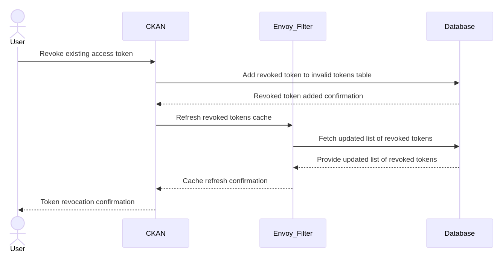

# Token Lifecycle Management

## Obtaining Tokens
<!--  -->

1. User initiates token creation through CKAN interface
2. CKAN validates user permissions
3. Token request sent to Keycloak with specified parameters
4. Keycloak generates JWT with appropriate claims
5. Token metadata stored in CKAN database
6. Token presented to user (displayed only once for security)

## Revoking Tokens

1. The user revokes an existing access token through the CKAN platform.
2. CKAN adds the revoked token to a list of invalid tokens stored in the PostgreSQL database.
3. CKAN sends a request to the Envoy Filter to refresh the cache of revoked tokens.

## Expiration Policies

- Default token lifespan: 6 months (configurable)
