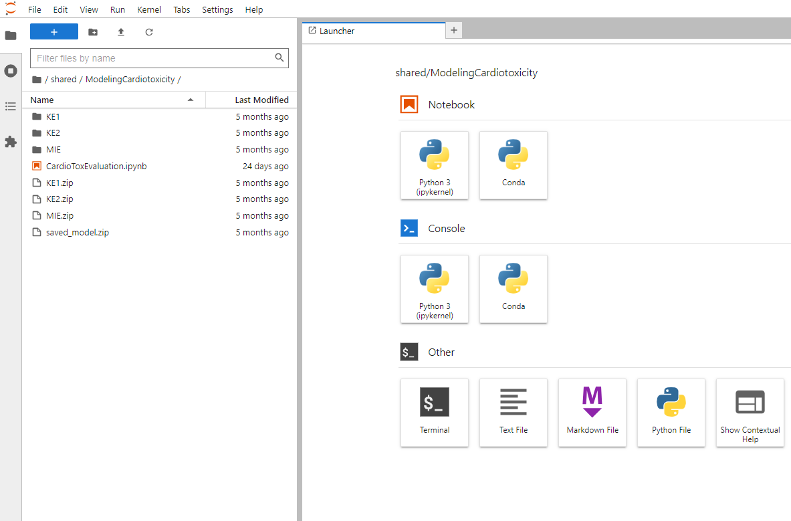

# User Services

## Overview

The user services provided by the ALTERNATIVE platform facilitate direct interaction with the platform's various features and tools.

## CKAN
The ALTERNATIVE platform's data sharing component utilizes CKAN, a web-based catalog platform designed for collaborative handling of large datasets. CKAN offers an intuitive web interface for creating, sharing, and managing different types of data with both internal teams and external audiences.

### Users, Organizations, and Authorization
CKAN, central to the ALTERNATIVE project, classifies users into regular users and sysadmin users. Sysadmin users can create organizations within the platform. Initially, an organization contains no datasets and has a single member, typically the creator. Unregistered users can search for and access public data, but registration is required for publishing activities and accessing personalization features. User identity and access management within CKAN is handled by Keycloak.

In the ALTERNATIVE platform, each consortium partner is represented as an organization with unique workflows and authorization mechanisms, allowing autonomous management of their publishing processes. Organizations control access to datasets, determining who can view, create, and modify them. Administrative personnel within an organization can add users and assign roles with varying levels of access and control:

- **Member Role:** Can view private datasets owned by the organization.
- **Editor Role:** Can edit and publish datasets in addition to viewing them.
- **Admin Role:** Can add, remove, and modify the roles of organization members, alongside all privileges of an Editor.

This structured approach ensures a streamlined and secure process for dataset management and publication, allowing each organization to maintain data integrity and confidentiality while facilitating collaboration and data sharing as per project objectives.

### Datasets, Resources, and Groups
The ALTERNATIVE platform handles data publication through "datasets," which are collections of metadata describing the data, along with various resources containing the actual data. The platform supports multiple data formats, including CSV, Excel, XML, PDF, image files, and linked data in RDF format. Resources are primarily stored in an S3 bucket within Cloud Storage but can also be external web links.

- **Dataset Exploration:** The platform offers a comprehensive interface for exploring datasets. Users can view a complete list of available datasets through the datasets menu or an organization's page. Upon selecting a dataset, its page is displayed with three main tabs:
    - **Dataset Tab:** Presents detailed information about the dataset, including a list of its resources.
    - 
    - **Groups Tab:** Manages which groups of users can access the dataset.
    - **Activity Stream Tab:** Chronicles the historical changes made to the dataset, providing a transparent audit trail.
- **Dataset Creation:** Creating a new dataset is intuitive. Users can initiate dataset creation from the 'Datasets' page by clicking 'Add Dataset' or from the 'Organisations' page by selecting the appropriate owning organization.
- 
- **Dataset Management:** Management privileges are based on user roles and associations. Users can manage any dataset they have created, any dataset owned by their organization, or any dataset where they are designated as a collaborator with at least an Editor role.
- **Resource Management within a Dataset:** Managing a dataset's resources is facilitated through the 'Resources' tab. Users can add new resources using the 'Add new resource' button, edit existing resources, and finalize changes using the 'Update Resources' button.
- **Metadata:** Each dataset contains metadata defined during creation or later. Metadata includes information like author, organization, and license, used for querying datasets. CKAN has been extended with custom metadata fields under "Advanced metadata for experiments," tailored for datasets in ALTERNATIVE’s scientific base.
  

## JupyterHub
JupyterHub is integrated into the ALTERNATIVE platform, offering researchers and scientists an environment for working with datasets and analytical workflows.

Authenticated users access JupyterHub via a single sign-on URL from the web portal, which spawns a dedicated JupyterHub server dynamically for them. This personalized workspace includes tools such as Jupyter notebooks, text editors, terminals, code consoles, file browsers, data visualization, and version control integration.

Jupyter Notebooks are versatile documents that integrate executable code, mathematical equations, graphics, and interactive visualizations. They facilitate exploratory analysis over datasets and rapid development of reusable scripts, machine learning pipelines, models, and applications in languages like Python and R.

To optimize resource usage, ephemeral notebook servers are automatically shut down after periods of inactivity, preserving workflow outputs and snapshots for future access. This balances responsive on-demand environments with efficient platform cost management at scale.

JupyterHub offers extensive customization options after server provisioning:
- **File Browser Pane:** Access control for data and workspace assets.
- **Tabbed Editor:** Concurrently work across documents like notebooks, code files, and markdown reports.
- **Terminals:** Manage dependencies or launch Docker environments.
- **Sidebar Tools:** Version control plugins, debuggers, data visualization toolkits, and an extensions catalog.
- **Global User Preferences:** Customize UI behavior, notebook runtimes, and resource visualization.
- **Keyboard Shortcuts:** Expedite navigation and frequent tasks.
- **Hub Control Panel:** Reconnect to central management consoles.
- **GitHub Integration Plugin:** Available in the sidebar.

An example of a standard data science-focused Jupyter notebook illustrates these integrated capabilities:

Each JupyterHub server includes two environments at startup: a default Python environment and an additional Conda environment. Users can choose the environment for their notebooks or consoles via the Launcher tab or Terminal:

- **Python Virtual Environments:** Independent sets of Python packages, isolated from the base environment.
- **Conda Environments:** Independent sets of Python or Conda packages.
- **Python Library:** The alternative-lib helps find datasets and download resources using ckanapi.
- **R Environment:** For statistical computing and graphics, accessible from the Terminal.
- **Bioconductor Integration:** A free toolkit for analyzing genetic data, integrated through R programming and Docker images.

## AI/ML API

The AI/ML API is a crucial component of the ALTERNATIVE platform, offering users access to a variety of machine learning models and algorithms. These models support data analysis, predictive modeling, and decision-making. Built on a scalable and efficient infrastructure, the AI/ML API allows users to run complex machine learning tasks with ease through a set of RESTful endpoints, which can be integrated into existing applications or used directly by users.